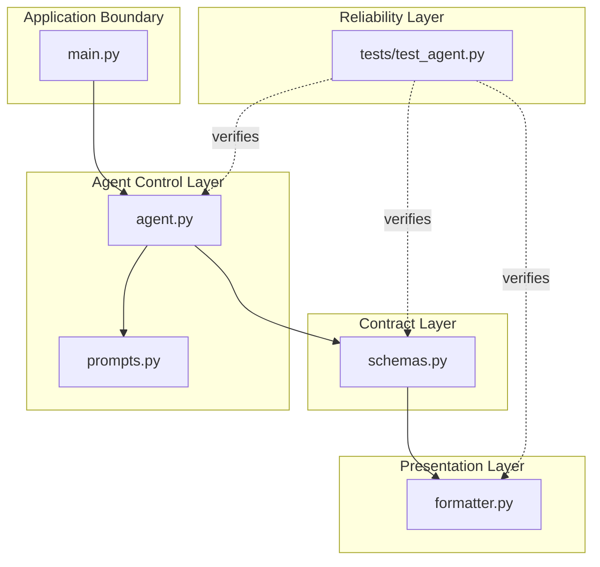

# Single Agent Systems

Patterns for building reliable task-oriented agents with clear inputs, tools, and control flow.

## Unit 01: Document Analysis Agent

The Document Analysis Agent is a disciplined single-agent system. It accepts plain text, applies one focused analysis step, and returns a structured result that can be checked before it is used anywhere else.

### What A Single-Agent System Is

A single-agent system uses one model-driven worker to complete one bounded task. The value comes from clarity: one input path, one prompt strategy, one response contract, and one validation boundary.

### Why One Agent Is Enough Here

This use case does not require delegation or orchestration. The document comes in as plain text, the task is to interpret that text, and the output is a compact analysis. Adding more agents would increase coordination cost without improving the core workflow.

### Why Structured Outputs Matter

Structured outputs make the system reliable. A summary alone is difficult to integrate, test, or compare. A fixed schema creates a stable contract for downstream code, evaluation, and human review.

### Why Controlled Flows Are Better Than Vague Autonomy At The Beginning

Early agent systems should favor explicit steps over vague autonomy. Controlled flows are easier to debug, easier to test, and easier to trust. This project keeps the system narrow on purpose: validate input, build prompt, invoke model, validate output, format result.

### How This Maps To Agent Systems Engineering Foundations

This project introduces the core habits of agent systems engineering:

- clear task definition
- disciplined prompt design
- strict output schemas
- modular system boundaries
- validation before response delivery
- basic testing around failure and formatting

These are the foundations that later support retrieval, modularity, evaluation, and more advanced agent architectures.

## Single-Agent System Architecture

